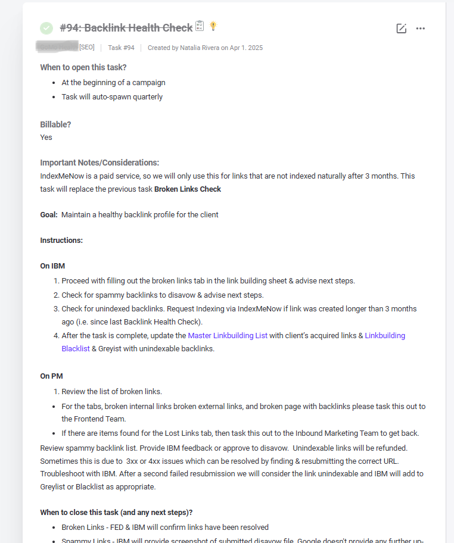
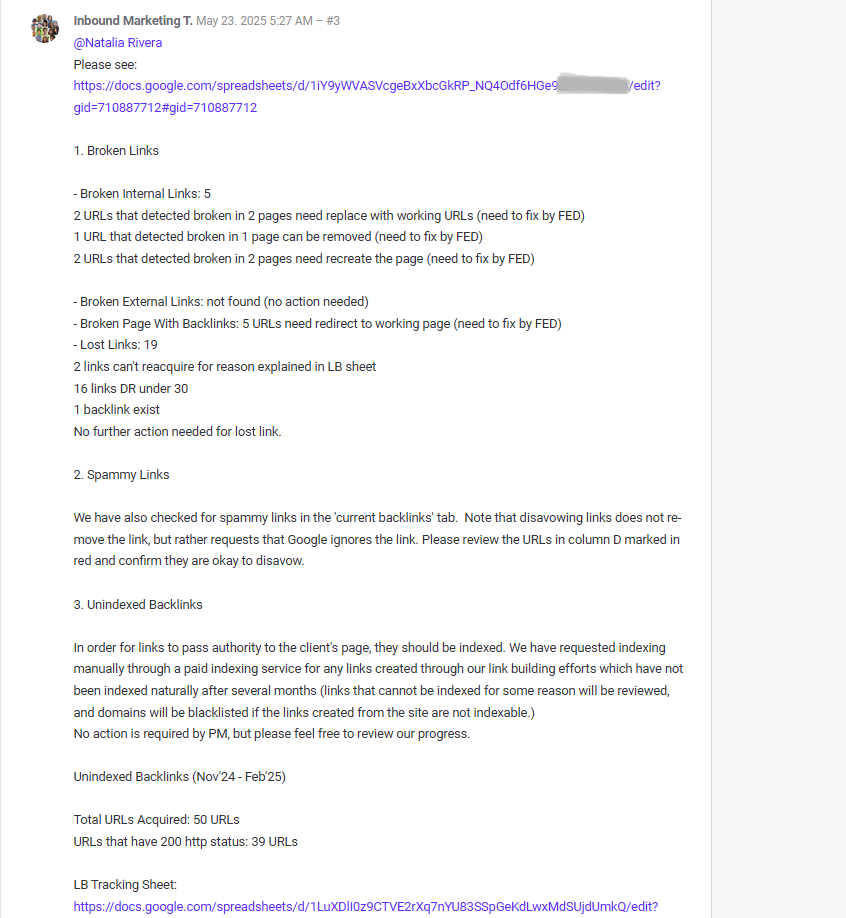

# SEO Backlink Health Check

## Project Overview

Proyek ini merupakan bagian dari aktivitas **Inbound Marketing Team** untuk melakukan monitoring dan maintenance backlink secara berkala.

Saya bertanggung jawab melakukan audit backlink menggunakan **Ahrefs**, mengolah hasil audit ke dalam spreadsheet, mengidentifikasi masalah, memberikan rekomendasi, menyusun laporan, serta melakukan follow-up berdasarkan hasil review Project Manager (PM).

---

## Peran Saya

Anggota Inbound Marketing Team (SEO)

Saya berkolaborasi dengan Project Manager (PM) untuk proses review dan approval, serta dengan Front End Developer (FED) untuk tindak lanjut teknis terkait broken pages dan broken internal links.

---

## Objective

Menjaga kesehatan backlink profile dengan mengidentifikasi dan menindaklanjuti:

- Spammy backlinks
- Lost backlinks
- Broken pages with backlinks
- Broken internal links
- Missing link building
- Unindexed backlinks

---

## Responsibilities

- Melakukan website backlink audit menggunakan **Ahrefs**.
- Mengunduh dan mengolah laporan **Current Backlinks, Lost Backlinks, Broken Pages with Backlinks, dan Broken Internal Links**.
- Mengidentifikasi backlink yang terindikasi spam dan menandainya untuk review.
- Memeriksa lost backlinks dan mencatat kondisi serta rekomendasi tindak lanjut.
- Memberikan rekomendasi redirect untuk broken pages with backlinks.
- Memberikan rekomendasi perbaikan untuk broken internal links.
- Melakukan verifikasi link building untuk memastikan backlink masih exist.
- Submit backlink hasil link building ke **IndexMeNow** setelah dilakukan verifikasi.
- Membuat laporan Backlink Health Check untuk direview oleh Project Manager.
- Melakukan follow-up indexing dan resubmission sesuai workflow setelah mendapat approval.

---

## Methodology & Workflow

### 1. Ahrefs Audit

Melakukan audit backlink website menggunakan Ahrefs dan mengunduh laporan:

- Current Backlinks
- Lost Backlinks
- Broken Pages with Backlinks
- Broken Internal Links

### 2. Data Processing

Laporan hasil export Ahrefs diolah ke dalam satu spreadsheet dan dipisahkan berdasarkan kategori untuk memudahkan proses audit dan tracking.

### 3. Backlink Review

**Current Backlinks**
- Mengidentifikasi backlink yang terindikasi spam.
- Menandai backlink yang perlu direview menggunakan indikator warna merah.

**Lost Backlinks**
- Memeriksa kembali setiap lost backlink.
- Mencatat status seperti backlink yang sudah kembali exist.
- Menandai backlink spam yang tidak perlu dipulihkan.
- Backlink dengan **DR < 30** dicatat sebagai tidak memerlukan tindakan sesuai workflow yang digunakan.

**Broken Pages with Backlinks**
- Mengidentifikasi halaman yang broken tetapi masih memiliki backlink.
- Memberikan rekomendasi redirect menuju working URL.

**Broken Internal Links**
- Mengidentifikasi broken internal links.
- Memberikan rekomendasi URL atau tindakan perbaikan untuk tim teknis.

### 4. Link Building Verification

Melakukan pengecekan kembali terhadap backlink dari aktivitas link building.

- Backlink yang hilang ditandai untuk follow-up.
- Backlink yang masih exist diverifikasi sebelum masuk ke proses indexing.

### 5. Indexing

Backlink hasil link building yang telah diverifikasi disubmit menggunakan **IndexMeNow**.

Status indexing kemudian dimonitor. Backlink yang belum terindeks dapat dilakukan resubmission hingga **3 kali** sesuai workflow yang digunakan.

### 6. Reporting & Follow-up

Setelah seluruh audit selesai, saya menyusun laporan Backlink Health Check dan menyerahkannya kepada **Project Manager** untuk review dan approval.

Setelah approval:

- Backlink spam ditindaklanjuti untuk proses disavow.
- Status indexing backlink dimonitor dan diperbarui.
- Backlink yang belum terindeks dilakukan resubmission sesuai workflow.
- Broken internal links dan broken pages ditindaklanjuti oleh **Front End Developer (FED)** berdasarkan rekomendasi yang telah saya dokumentasikan.

---

## Audit Findings

| Category | Findings | Action Taken |
|---|---:|---|
| Broken Internal Links | 5 URLs | Recommended replacement URLs, removal, or page recreation |
| Broken Pages with Backlinks | 5 URLs | Recommended relevant 301 redirects |
| Lost Backlinks | 19 URLs | Reviewed status and prioritized follow-up actions |
| URLs Acquired | 50 URLs | Monitored for indexing status |
| URLs with HTTP 200 | 39 URLs | Included in indexing monitoring and resubmission workflow |

### Broken Internal Links

Dari 5 broken internal links:

- 2 URL memerlukan penggantian dengan working URL.
- 1 URL dapat dihapus.
- 2 URL memerlukan pembuatan kembali halaman.

### Broken Pages with Backlinks

5 URL ditemukan pada broken pages dan diberikan rekomendasi redirect menuju halaman yang relevan.

### Lost Backlinks

19 backlink ditemukan sebagai lost backlinks dan diperiksa satu per satu berdasarkan kondisi masing-masing.

### Unindexed Backlinks

Dari 50 URL yang diperoleh pada periode monitoring, 39 URL memiliki **HTTP status 200** dan menjadi bagian dari proses monitoring indexing.

---

## Reporting Example

Laporan akhir digunakan untuk merangkum hasil audit, rekomendasi, dan tindak lanjut:

| Task Brief | Final Report |
|---|---|
|  |  |

### Bukti Pendukung

Dokumentasi tambahan yang telah dianonimkan:

- [Final Report](assets/screenshots/backlink-health-check-final-report-detail-2.png)
- [Broken Internal Links Analysis](assets/screenshots/backlink-health-check-broken-internal-links.png)
- [Spammy Backlinks Analysis](assets/screenshots/spammy-backlinks-analysis.png)
- [Unindexed Backlinks Monitoring](assets/screenshots/unindexed-backlinks-monitoring.png)

---

## Tools

- **Ahrefs** — Backlink audit and analysis
- **Google Sheets / Microsoft Excel** — Data processing, tracking, and reporting
- **IndexMeNow** — Backlink indexing submission
- **Screamingfrog** — URLs analysis

---

## Skills Demonstrated

- Backlink Audit
- SEO Data Analysis
- Data Classification
- Data Cleaning
- Spreadsheet Management
- Link Building Verification
- Indexing Monitoring
- SEO Reporting
- Documentation
- Cross-team Coordination

---

## Outcome

Audit ini menghasilkan backlog isu backlink dan rekomendasi tindak lanjut yang terdokumentasi, meliputi:

- 5 broken internal links yang diklasifikasikan berdasarkan tindakan: penggantian URL, penghapusan, atau pembuatan ulang halaman.
- 5 broken pages yang masih memiliki backlink, dilengkapi rekomendasi redirect ke halaman relevan.
- 19 lost backlinks yang ditinjau satu per satu untuk menentukan prioritas recovery atau status no action.
- 39 URL dengan HTTP status 200 yang masuk ke proses monitoring indexing dan resubmission.
- Laporan terstruktur untuk review PM serta koordinasi implementasi dengan FED.

> Nama klien, domain, URL, dan data sensitif telah dianonimkan untuk kebutuhan portofolio.

---

## Confidentiality Note

All client names, domains, URLs, internal project details, and sensitive data have been anonymized or redacted for portfolio purposes. The screenshots are provided only to demonstrate the workflow, documentation, and SEO analysis process.
